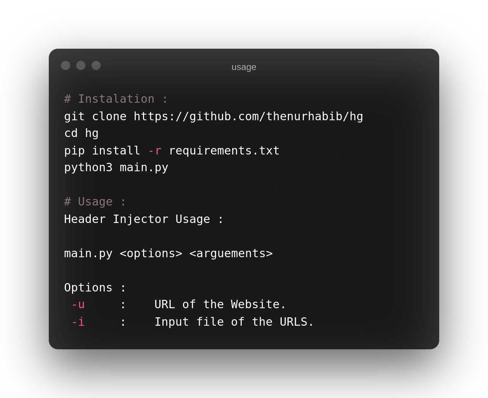
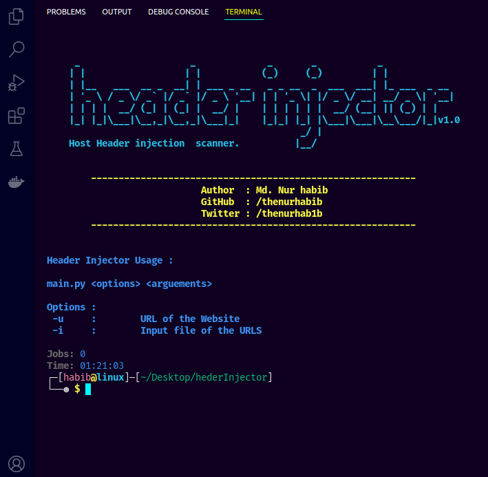

# Heder Injector - Host Header Injection Scanner Tool.

#### hederInjector is a Host Header Injection vulnerability finder tool. You can use this tool to find Host Header Injection vulnerability in any website if it avalable.
  
<br>
<br> 

## Badges

[](https://opensource.org/licenses/)

<br><br> 



<br><br><br><br> 


## Download & Install : 

```
git clone https://github.com/thenurhabib/hg
cd hg
pip install -r requirements.txt
python3 main.py
```
<br>
<br> 

## Usage :
```
Header Injector Usage : 

main.py <options> <arguements>
 
Options : 
 -u 	:	 URL of the Website. 
 -i 	:	 Input file of the URLS.
 ```

<br>
<br> 

## Screenshort :



## Authors

- [@Md. Nur Habib](https://www.github.com/octokatherine)


## Support

For support, email thenurhabib@gmail.com

